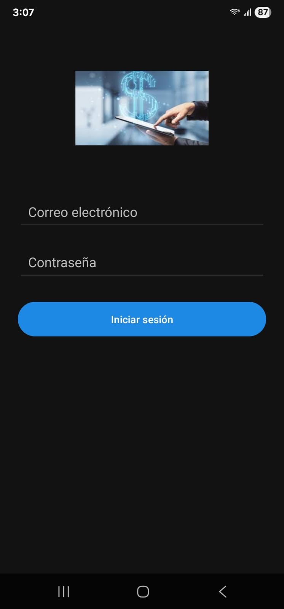
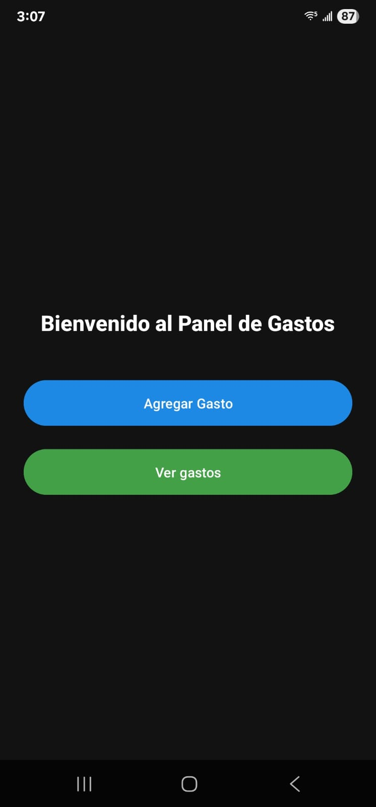
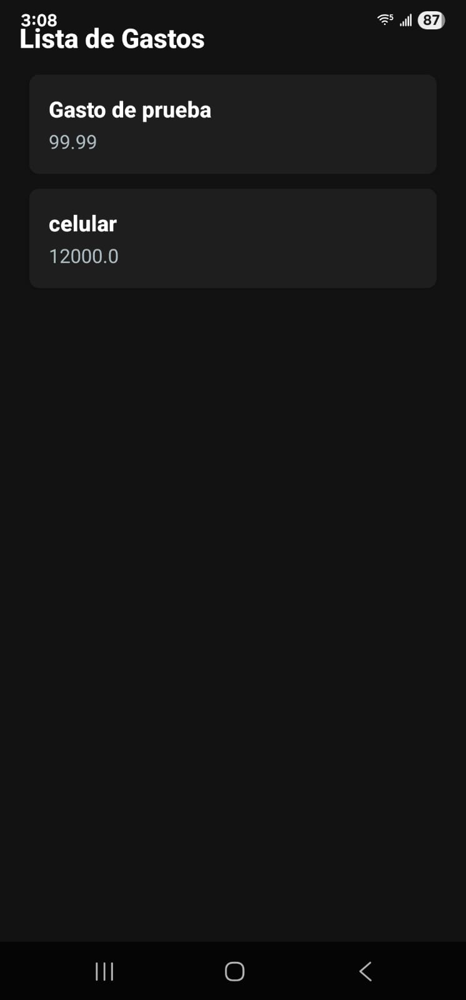
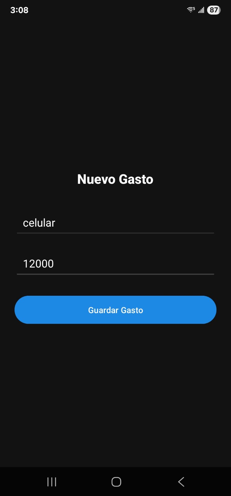
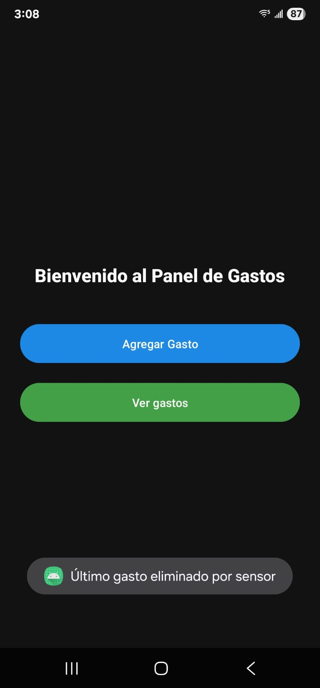

# GastoPersonalApp

**GastoPersonalApp** es una aplicación Android desarrollada en **Java** que permite gestionar gastos personales de manera sencilla.  
El proyecto fue creado como práctica académica y combina conceptos de **bases de datos, sensores y diseño de interfaces en Android Studio**.

---

## Características principales
- **Inicio de sesión** con validación de usuario y contraseña.
- **Dashboard** para acceder rápidamente a las funciones principales.
- **Registro de gastos** con descripción, monto y fecha.
- **Listado dinámico** de gastos en un `RecyclerView`.
- **Edición y eliminación** de gastos.
- **Base de datos local SQLite** para persistencia de información.
- **Interfaz moderna y responsiva** con layouts en XML.
- **Sensor de movimiento**: la app integra el acelerómetro para detectar movimiento del dispositivo.

---

## Tecnologías utilizadas
- **Lenguaje:** Java (Android)
- **IDE:** Android Studio
- **Base de datos:** SQLite
- **UI:** XML + RecyclerView
- **Sensores:** Acelerómetro
- **Control de versiones:** Git y GitHub

---

## Capturas de pantalla

### Login


### Dashboard


### Lista de gastos


### Agregar gasto


### Sensor de movimiento


---

## Instalación y uso
1. Clona este repositorio:
   ```bash
   git clone git@github.com:oliver-cloudsec/App-Android-.git
